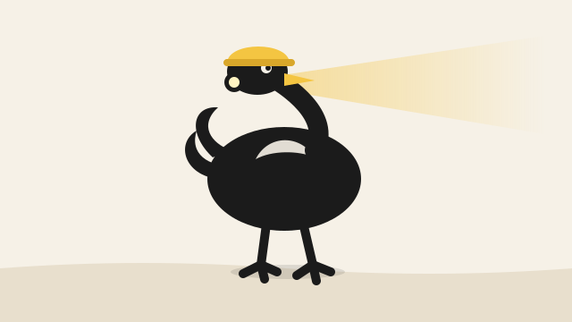

# osstrich

[](LICENSE)

<p align="center"></p>

The bird that takes its head out of the sand.

You depend on a few hundred open-source projects. Some are tiny, tired, and one bug away from ruining your week. osstrich reads *your* repo, finds the libraries where your next step and their open issue are the same thing, and fixes it upstream the way the maintainer would have.

## What it does

- **`osstrich discover`** — every project you run, least popular first, community before company, crossed against your backlog and workarounds. One table: fund, defer, skip.
- **`osstrich build <repo | issue | patch>`** — their norms, the failing test first, the smallest fix, in their voice, with your name on it.
- **The gate between them** — is there a way to use the library that makes the fix optional? Then the fix is a gift, not a chore.

A runbook for an AI coding agent plus a few deterministic scripts. Not a bot: every outward action waits for a human "go".

## How it thinks

### 1. Discover: what should we contribute?

```
+------------------------------------------------------------------+
| YOUR REPO -> THE LIBRARY LIST                             [code] |
| Q: what do we run?                                               |
| 7 readers at once: locks, pins, actions, images, hosts, patches  |
+------------------------------------------------------------------+
          |                       |                       |
          |   three branches at once, none waits          |
          v                       v                       v
+--------------------+  +--------------------+  +--------------------+
| POPULARITY  [code] |  | OUR NEEDS   [code] |  | THEIR ITEMS [code] |
| Q: how far behind, |  | Q: what is our     |  | Q: what are they   |
|    how loved, who  |  |    next step with  |  |    stuck on?       |
|    owns it?        |  |    it?             |  | A: open issues and |
| A: registry and    |  | A: explicit: your  |  |    PRs, one worker |
|    GitHub lookups  |  |    board, if any   |  |    per library,    |
|    for every row   |  |    inferred: pins, |  |    every library;  |
|          |         |  |    patches, TODOs, |  |    budget checked  |
|          v         |  |    "retire once X  |  |    per batch       |
| RANK               |  |    ships" notes    |  |                    |
| Q: who will nobody |  |    (no board? the  |  |                    |
|    else fix?       |  |    inferred half   |  |                    |
| A: stars+downloads |  |    is enough)      |  |                    |
|    averaged, comm- |  |                    |  |                    |
|    unity first ->  |  |                    |  |                    |
|    the bottom N    |  |                    |  |                    |
+---------+----------+  +---------+----------+  +---------+----------+
          |                       |                       |
          +-----------------------+-----------------------+
                                  v  join
+------------------------------------------------------------------+
| OVERLAP                                                     [AI] |
| Q: is this need of ours really this item of theirs, or a bug we  |
|    found that they were never told about?                        |
| order and depth from RANK: bottom N read in full, rest by keyword|
| A: candidates, one need to one item each                         |
+---------------------------------+--------------------------------+
                                  v  candidates judged in parallel
+------------------------------------------------------------------+
| VERDICT                                                     [AI] |
| fund = overlap + evidence      defer = overlap, no evidence yet  |
| skip = no overlap              gift = only if nothing funds      |
+---------------------------------+--------------------------------+
                                  v  one gate per funded item, at once
+==================================================================+
| GATE                                                        [AI] |
| Q: is there another way to use the library that makes the        |
|    upstream fix optional?                                        |
| yes -> fix our side; the upstream item becomes a gift            |
| no  -> upstream is the fix                                       |
+=================================+================================+
                                  v
                    the table, written to disk               [code]
                     |                              |
                     v                              v
              human "go"  [human]            persist and stop
              -> BUILD on the top            (a later build picks
                 funded item                  any row up)
```

### 2. Build: contribute this one

```
+------------------------------------------------------------------+
| THE TARGET                                                  [AI] |
| Q: which repo, what breaks, for whom? is it a patch we carry?    |
+-------+---------------+---------------+---------------+----------+
        |               |               |               |
        |         four at once          |               |
        v               v               v               v
+-------------+ +-------------+ +-------------+ +-----------------+
| rules  [AI] | | discuss[AI] | | maint. [AI] | | STILL BROKEN?   |
| guide, CI,  | | tried       | | asks,       | |          [code] |
| lint, tests | | before? a   | | rejects,    | | run their tests |
|             | | rival PR?   | | merges?     | | on latest code; |
|             | |             | |             | | no -> stop      |
+------+------+ +------+------+ +------+------+ +--------+--------+
       |               |               |                 |
       +---------------+-------+-------+-----------------+
                               v  join; live beats our old notes
+------------------------------------------------------------------+
| HOW THEY WORK + a 4th scout for what the three missed       [AI] |
+---------------------------------+--------------------------------+
                                  v  serial by design
+------------------------------------------------------------------+
| FAILING TEST, in their shape, red on their code   [AI writes,    |
|                                                    code runs]    |
+---------------------------------+--------------------------------+
                                  v  only once it is red
+------------------------------------------------------------------+
| FIX: the smallest change that removes the cause             [AI] |
+----------+---------------------+---------------------+-----------+
           |                     |                     |
           |          three proofs at once             |
           v                     v                     v
+------------------+  +--------------------+  +--------------------+
| FULL SUITE [code]|  | STRICTEST CI [code]|  | SCRUB        [code]|
| all green?       |  | green there too?   |  | anything private?  |
+---------+--------+  +----------+---------+  +----------+---------+
          |                      |                       |
          +----------------------+-----------------------+
                                 v  join: real counts, nothing private
+------------------------------------------------------------------+
| THE PR                                                      [AI] |
| Q: would the maintainer have written it this way?                |
| symptom, cause, change, tests; rivals named fairly               |
+---------------------------------+--------------------------------+
                                  v
          human "go" [human] -> opened -> reviews answered, rivals deferred to
```

### 3. Capture: what should next time know?

```
+------------------------------------------------------------------+
| after the PR is open, or the fix landed on our side              |
+--------------------+-------------------------+-------------------+
                     |       two at once       |
                     v                         v
+-------------------------------+  +-------------------------------+
| RUN RECORD             [code] |  | LEARNING PASS           [AI]  |
| Q: what happened, in numbers? |  | Q: what did this teach that a |
| A: candidates, funded, gate   |  |    rule should carry?         |
|    outcomes, PRs opened,      |  | A: notes on this repo, dated; |
|    review rounds, patches     |  |    rules changed; every       |
|    retired                    |  |    "retire once X ships"      |
|                               |  |    claim re-checked           |
+---------------+---------------+  +---------------+---------------+
                |                                  |
                +----------------+-----------------+
                                 v
                    the next run starts smarter
```
