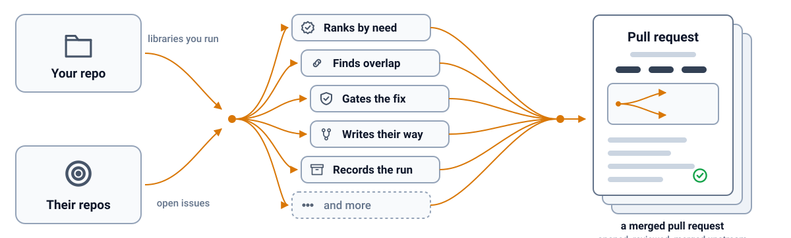

<h1 align="center">🦤 osstrich</h1>

  <b>Finds the dependency that owes you a fix, and ships it as a pull request.</b>

  
  
  
  
  

Works with 
  

## Features

osstrich reads what your repo actually depends on and turns the one dependency costing you time into a merged pull request.

🎯 <b>Funds the real cost</b> Your own next step matched against their open issue, not a browsed backlog.

🌱 <b>Community first</b> Company-backed projects rank behind the ones nobody else will fix.

🚪 <b>Gated before it builds</b> Skips the pull request when a different way of using the library fixes it for you instead.

🗣️ <b>Ships in their voice</b> Their tests first, their style, their commit format, your name on it.

🔒 <b>Scrubbed before it's public</b> Every diff runs through gitleaks before a branch or a pull request goes anywhere external.

📒 <b>Counted, not narrated</b> One run record: candidates, funded, gate outcomes, pull requests opened, patches retired.

## Fit

Use it when:

- Your repo depends on more open source projects than you can watch, and you want the one whose problem is also yours found automatically.
- You already know which library and issue to fix, and want the pull request written and posted in the maintainer's own voice.
- You want contribution effort to go to the smallest, most under-resourced project first, not the loudest one.

Look elsewhere when:

- You want dependency version bumps, not code fixes: that is Dependabot's job.
- You want a general coding agent for your own repo's work: that is OpenHands's job.
- You want to browse curated issues yourself rather than have your own dependency tree read and ranked.

Install it from the tarball GitHub attaches to each release; the exact command is in CONTRIBUTING.

## How it compares

| | [oficiallyAkshay/osstrich](https://github.com/oficiallyAkshay/osstrich) | [OpenHands/OpenHands](https://github.com/OpenHands/OpenHands) | [dependabot/dependabot-core](https://github.com/dependabot/dependabot-core) | [cutenode/good-first-issue](https://github.com/cutenode/good-first-issue) |
| --- | --- | --- | --- | --- |
| Reads your dependencies | ✅ | ❌ | ✅ | ❌ |
| Ranks by need | ✅ | ❌ | ❌ | ❌ |
| Finds the overlap | ✅ | ❌ | ❌ | ❌ |
| Gates the fix | ✅ | ❌ | ❌ | ❌ |
| Ships a code fix | ✅ | ✅ | Version bumps | ❌ |
| Installation | Tarball | npm | Library | npm |

## Security and limits

No credential of its own. On PATH: `gh`, `gitleaks`, one headless coding agent CLI. Each already holds its own auth, so osstrich never sees a token.

- ❌ reads, stores or transmits your credentials itself
- ❌ touches your own repository's settings, branches or releases
- ❌ contacts any service of its own
- ❌ adds a runtime dependency beyond what package.json declares
- ❌ updates itself
- ❌ leaves personal information or your own internal names in a diff, commit or pull request body it sends externally

By default every diff is scrubbed for secrets before it is proposed, and nothing opens, pushes or comments without your explicit go. It needs Node 22 or newer.
